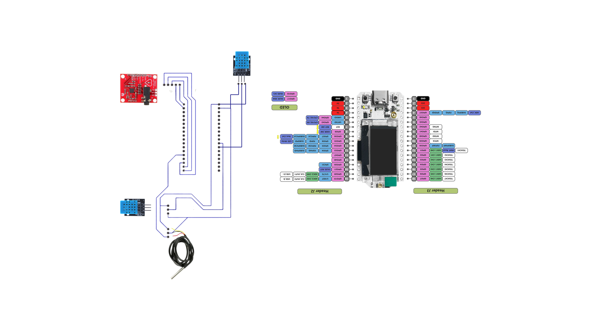
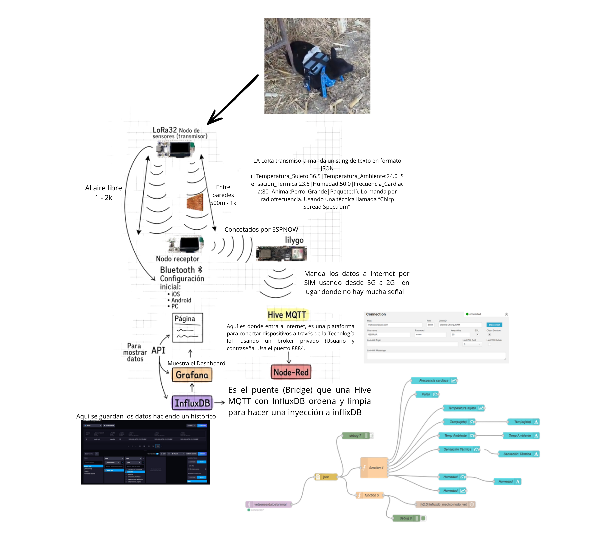

# Sistema de Monitoreo Inalámbrico para Animales de Granja
### Post-Fractura y Post-Quirúrgico mediante LoRa + ESP-NOW + MQTT

- Gerardo Daniel Olivares Álvarez (230110052)
- Diego Antonio Badillo Morales (230110025)
- Ricardo López Cruz (230110088)
- Daniel Aldana López (230110150)


## Introducción
Este proyecto implementa un sistema de monitoreo inalámbrico orientado al cuidado post-operatorio y post-fractura de animales de granja, principalmente bovinos (vacas) y ovinos (borregos). El sistema mide en tiempo real parámetros fisiológicos críticos para garantizar la recuperación adecuada del animal y detectar complicaciones de forma temprana.
La arquitectura se basa en tres nodos interconectados:

Nodo Transmisor (NODO_MEDICO_01) → colocado en el animal con todos los sensores
Nodo Receptor (CENTRAL_RECEPTORA) → instalado en el corral/establo, recibe por LoRa
Gateway Celular (LILYGO T-SIM7000G) → publica los datos a la nube vía MQTT

La comunicación entre nodos usa LoRa para el enlace de largo alcance y ESP-NOW para el enlace local entre el receptor y la Lilygo.

## Justificación
El monitoreo continuo de animales en recuperación post-quirúrgica o post-fractura es crítico para detectar a tiempo complicaciones como infecciones (fiebre en zona de lesión), arritmias cardíacas o estrés térmico. Las soluciones convencionales requieren revisiones manuales frecuentes del veterinario, lo que aumenta costos y riesgo de complicaciones no detectadas. Este sistema automatiza la supervisión de forma inalámbrica, de bajo costo y con alcance adecuado para entornos rurales.

## Objetivo general
Diseñar e implementar un sistema de monitoreo telemétrico basado en el IoT (VetSense) para la supervisión continua de variables biofísicas en animales de ganado que se encuentren bajo procesos de recuperación por daño tisular o intervenciones quirúrgicas, evitando anomalías infecciosas, usando una arquitectura híbrida de comunicación ( LoRa/GPRS).

### Objetivos específicos
- Configurar la red inalámbrica mediante transceptores LoRa (SX1262) y un Gateway GPRS, para transmitir los datos al broker MQTT superando la falta de Wi-Fi en zonas rurales.

- Implementar el sistema de gestión de datos mediante flujos en Node-RED y la base de datos InfluxDB, para almacenar el historial biométrico y facilitar el análisis clínico veterinario.

- Diseñar las interfaces de visualización mediante dashboards en Grafana y una aplicación web, para ofrecer al veterinario un sistema de alertas visuales basado en umbrales fisiológicos.

- Validar la autonomía y confiabilidad del prototipo mediante pruebas de campo en animales y el monitoreo de baterías, para verificar la precisión y estabilidad del enlace bajo condiciones críticas.

## Requerimientos
## Hardware
 
| Componente | Cantidad | Descripción |
|---|---|---|
| Heltec LoRa V3 (ESP32-S3 + SX1262) | 2 | Nodo Transmisor y Nodo Receptor |
| LILYGO T-SIM7000G | 1 | Gateway celular NB-IoT/LTE-M |
| AD8232 | 1 | Módulo ECG / frecuencia cardíaca |
| DS18B20 | 1 | Sensor temperatura zona de lesión (1-Wire) |
| DHT11 | 2 | Uno para humedad (GPIO 34) y otro para temperatura ambiente (GPIO 1) |
| Batería LiPo 3.7V / 1000 mAh | 1 | Alimentación móvil del nodo reseptor |
| Powerbank 5V / 5000 mAh | 1 | Alimentación móvil del nodo transmisor |
| Panel solar 5V / 200mA | 1 (opcional) | Recarga de batería en campo |
| Resistencia 4.7 kΩ | 1 | Pull-up para DS18B20 |
| Resistencia 10 kΩ | 2 | Pull-up para DHT11 |
| Antena 433 MHz | 2 | Para Heltec LoRa V3 (transmisor y receptor) |
| Fuente 5V / 1A | 1 | Alimentación fija para receptor y gateway |
 
### Software / Librerías (Arduino IDE)
 
| Librería | Versión recomendada | Uso |
|---|---|---|
| RadioLib | >= 6.x | Control del SX1262 (LoRa) |
| SSD1306Wire | >= 4.x | Pantalla OLED Heltec |
| DallasTemperature | >= 3.9 | Sensor DS18B20 |
| OneWire | >= 2.3 | Bus 1-Wire para DS18B20 |
| DHT sensor library (Adafruit) | >= 1.4 | Sensores DHT11 |
| ESP-NOW | Incluida en ESP-IDF | Comunicación receptor ↔ gateway |
| BLEDevice / BLEServer | Incluida en ESP-IDF | BLE para app NodoVet |
| ArduinoMqttClient o PubSubClient | >= 2.8 | MQTT en gateway LILYGO |
 
> **Placa:** Heltec WiFi LoRa 32(V3) — instalar desde Boards Manager con la URL de Heltec.
 
---

# Tabla de Conexiones — Nodo Transmisor
 
| Sensor / Módulo | Señal | Pin GPIO (Heltec LoRa V3) | Notas |
|---|---|---|---|
| AD8232 (ECG/BPM) | OUT | GPIO 6 | Señal analógica ECG |
| AD8232 | LO+ | GPIO 5 | Detección de derivación |
| AD8232 | LO- | GPIO 7 | Detección de derivación |
| DS18B20 (Temp. lesión) | DATA | GPIO 3 | Pull-up 4.7 kΩ a 3.3 V |
| DHT11 (Humedad) | DATA | GPIO 34 | Pull-up 10 kΩ, solo humedad |
| DHT11 (Temp. ambiente) | DATA | GPIO 1 | Pull-up 10 kΩ, solo temperatura |
| SX1262 (LoRa) | NSS | GPIO 8 | SPI Chip Select |
| SX1262 | DIO1 | GPIO 14 | Interrupción LoRa |
| SX1262 | RST | GPIO 12 | Reset radio |
| SX1262 | BUSY | GPIO 13 | Estado ocupado |
| SX1262 | SCK / MISO / MOSI | GPIO 9 / 11 / 10 | Bus SPI |
| OLED SSD1306 | SDA / SCL | GPIO 17 / 18 | I2C, dirección 0x3C |
| VEXT / RST OLED | — | GPIO 36 / 21 | Control alimentación pantalla |
 
---
 
## Tabla de Direccionamiento
 
| Parámetro | Valor |
|---|---|
| **Frecuencia LoRa** | 433.0 MHz |
| **Spreading Factor** | SF 12 |
| **Bandwidth** | 62.5 kHz |
| **Coding Rate** | 4/8 |
| **Potencia TX** | +22 dBm |
| **SyncWord** | 0xAB |
| **MAC Gateway (LILYGO)** | C8:2E:18:AC:50:90 |
| **Canal ESP-NOW / Wi-Fi** | Canal 6 |
| **Broker MQTT** | broker.hivemq.com |
| **Puerto MQTT** | 1883 |
| **Tópico Temperatura Sujeto** | `animales/nodo01/Temperatura_Sujeto` |
| **Tópico Temperatura Ambiente** | `animales/nodo01/Temperatura_Ambiente` |
| **Tópico Sensación Térmica** | `animales/nodo01/Sensacion_Termica` |
| **Tópico Humedad** | `animales/nodo01/Humedad` |
| **Tópico Frecuencia Cardíaca** | `animales/nodo01/Frecuencia_Cardiaca` |
| **Tópico Paquete** | `animales/nodo01/Paquete` |
| **UUID Servicio BLE** | `12345678-1234-1234-1234-123456789abc` |
| **Nombre BLE** | `NodoMedico_01` |
 


---
### Comunicación I²C
| Dispositivo | Dirección | SDA | SCL |
|---|---|---|---|
| OLED SSD1306 | `0x3C` | GPIO 17 | GPIO 18 |

### Comunicación SPI (LoRa SX1262)
| Señal | GPIO |
|---|---|
| NSS (CS) | 8 |
| DIO1 | 14 |
| NRST | 12 |
| BUSY | 13 |
| SCK | 9 |
| MISO | 11 |
| MOSI | 10 |

### Sensores digitales (1-Wire / DHT11)
| Sensor | Protocolo | GPIO |
|---|---|---|
| DS18B20 (temperatura sujeto) | 1-Wire | 3 |
| DHT11 — humedad | DHT | 34 |
| DHT11 — temperatura ambiente | DHT | 1 |

### Sensor ECG (AD8232)
| Señal | GPIO | Modo |
|---|---|---|
| OUT (señal analógica) | 6 | `INPUT` / `analogRead` |
| LO+ (leads-off detección) | 5 | `INPUT` digital |
| LO− (leads-off detección) | 7 | `INPUT` digital |

---



---

### Control de energía y pantalla
| Función | GPIO | Estado activo |
|---|---|---|
| VEXT (alimentación periféricos) | 36 | `LOW` = encendido |
| RST OLED | 21 | `LOW` → `HIGH` = reset |

### Comunicación inalámbrica
| Tecnología | Parámetro | Valor |
|---|---|---|
| LoRa | Frecuencia | 433.0 MHz |
| LoRa | Spreading Factor | 12 |
| LoRa | Bandwidth | 62.5 kHz |
| LoRa | Coding Rate | 8 |
| LoRa | Potencia | 22 dBm |
| LoRa | Sync Word | `0xAB` |
| BLE | Service UUID | `12345678-1234-1234-1234-123456789abc` |
| BLE | Char. configuración | `...ab1` — WRITE |
| BLE | Char. estado/notify | `...ab2` — NOTIFY |Sonnet 4.6

---

## Esquema de Funcionamiento



**Formato del payload LoRa:**
```
T:36.5|A:24.1|S:25.3|H:60.0|B:72|P:145
│      │      │      │      │    └─ Número de paquete
│      │      │      │      └─ BPM (frecuencia cardíaca)
│      │      │      └─ Humedad relativa (%)
│      │      └─ Sensación térmica (°C)
│      └─ Temperatura ambiente DHT11 (°C)
└─ Temperatura zona de lesión DS18B20 (°C)
```
 
**JSON enviado por MQTT:**
```json
{
  "Temperatura_Sujeto": 36.5,
  "Temperatura_Ambiente": 24.1,
  "Sensacion_Termica": 25.3,
  "Humedad": 60.0,
  "Frecuencia_Cardiaca": 72,
  "Paquete": 145
}
```

## Códigos

| Archivo | Nodo | Descripción |
|---|---|---|
| [Codigo/Transmisor.ino](Código/Transmisor.ion) | Transmisor | Lectura de sensores, cálculo BPM con AD8232, envío LoRa + BLE |
| [Codigo/Receptor.ino](Código/Reseptor.ion) | Receptor | Recepción LoRa, display OLED, reenvío ESP-NOW al gateway |
| [Codigo/Lilygo.ino](Código/Lilygo.ion) | Gateway | Resive los datos y los manda por un broker privado a Hive MQTT |
| [Node.md](Código/Node.md) | Node-red, influxdb y java  | Resive los datos y los manda por un broker privado a Hive MQTT |


## Explicación de configuraciones de sensores y tarjetas

### Heltec LoRa V3 (ESP32-S3 + SX1262)
La tarjeta se inicializa con `SPI.begin(9, 11, 10, 8)` y el radio con `radio.begin(433.0)`. Parámetros configurados en el firmware:

| Parámetro | Valor | Razón |
|---|---|---|
| Frecuencia | 433.0 MHz | Banda ISM libre en México (NOM-121-SCT1-2009) |
| Spreading Factor | SF12 | Máximo alcance, mínima tasa de datos |
| Bandwidth | 62.5 kHz | Mayor sensibilidad (+3 dB vs 125 kHz) |
| Coding Rate | 4/8 | Mayor redundancia para enlaces débiles |
| Potencia TX | +22 dBm | Máximo del SX1262, dentro del límite legal |
| Corriente máx. | 140 mA | Protección del regulador de la tarjeta |
| SyncWord | 0xAB | Identificador exclusivo de la red |

La pantalla OLED se activa poniendo `VEXT_CONTROL (GPIO 36)` en LOW y reseteando con `RST_OLED (GPIO 21)`. Dirección I2C: `0x3C`.

---

### AD8232 (Frecuencia Cardíaca / ECG)
Lee la señal analógica en `GPIO 6`. Los pines `LO+` (GPIO 5) y `LO-` (GPIO 7) detectan si los electrodos están mal colocados; si alguno está en HIGH, la lectura se descarta. Al arrancar, el firmware realiza una **calibración automática de 15 segundos** donde mide el rango de la señal y calcula el umbral de detección de pico como el 60% del rango.

| Constante | Valor | Descripción |
|---|---|---|
| `SAMPLES` | 20 | Muestras del filtro de media móvil |
| `NUM_MEDICIONES` | 3 | Mediciones para el filtro de mediana |
| `CALIBRATION_TIME` | 15000 ms | Tiempo de calibración al inicio |
| `MEASUREMENT_INTERVAL` | 10000 ms | Intervalo entre envíos LoRa |
| `MAX_VARIACION_BPM` | 25 lpm | Máxima variación aceptada entre lecturas |

---

### DS18B20 (Temperatura zona de lesión)
Protocolo 1-Wire en `GPIO 3`. Requiere resistencia pull-up de **4.7 kΩ** entre DATA y 3.3V. Se inicializa con `sensorTemp.begin()` y se lee con:
```cpp
sensorTemp.requestTemperatures();
float tempCuerpo = sensorTemp.getTempCByIndex(0);
```
Resolución por defecto: 12 bits (0.0625°C). Se coloca **bajo el vendaje o yeso** del animal para detectar procesos inflamatorios.

---

### DHT11 — Configuración dual (dos sensores independientes)
El firmware usa **dos instancias DHT11 separadas** para evitar interferencia entre lecturas:

| Instancia | GPIO | Variable leída |
|---|---|---|
| `dhtHumedad` | GPIO 34 | Solo `readHumidity()` |
| `dhtTemp` | GPIO 1 | Solo `readTemperature()` |

Cada lectura incluye un reintento automático con `delay(500)` si devuelve `NaN`. Requieren pull-up de **10 kΩ** cada uno.

---

### LILYGO T-SIM7000G (Gateway Celular)
Recibe el JSON vía ESP-NOW en la MAC `C8:2E:18:AC:50:90` y lo publica al broker `broker.hivemq.com` puerto `1883`. El canal Wi-Fi se fija en **canal 6** en ambos dispositivos:
```cpp
esp_wifi_set_channel(6, WIFI_SECOND_CHAN_NONE);
```
JSON publicado por MQTT:
```json
{
  "Temperatura_Sujeto": 36.5,
  "Temperatura_Ambiente": 24.1,
  "Sensacion_Termica": 25.3,
  "Humedad": 60.0,
  "Frecuencia_Cardiaca": 72,
  "Paquete": 145
}
```

---

## Explicación de Alimentación Móvil y Fija

### Móvil — Nodo Transmisor (colocado en el animal)
Alimentado con **powerbank 5V / 5000 mAh** conectada al tipo-c de la Heltec LoRa V3.

| Componente | Consumo |
|---|---|
| LoRa activo | ~85 mA |
| SX1262 transmitiendo +22 dBm | ~140 mA |
| AD8232 | ~0.17 mA |
| DS18B20 | ~1.5 mA |
| DHT11 ×2 | ~2.5 mA |
| OLED SSD1306 | ~20 mA |
| BLE activo | ~30 mA |
| **Total ciclo activo** | **~279 mA** |

**Durante el deep-sleep (~60 segundos):**

| Componente | Consumo |
|---|---|
| LoRa activo | ~0.01 mA |
| AD8232 | ~0.17 mA |
| DS18B20 | ~1.5 mA |
| DHT11 ×2 | ~2.5 mA |
| OLED SSD1306 | ~0 mA |
| BLE activo | ~0 mA |
| **Total ciclo sleep** | **~4.2 mA** |

**Autonomía estimada con batería LiPo 2000 mAh:**
> Ciclo: 10 s activo (279 mA) + 60 s sleep (4.2 mA)
> Consumo promedio = (279×10 + 4.2×60) / 70 ≈ **43.6 mA**
> Autonomía ≈ 2000 mAh / 43.6 mA ≈ **~45 horas sin recarga**

### Fija — Nodo Receptor y Gateway (instalados en el establo)
Alimentados con **Pila Lipo 3.7V / 1000 mAh** conectada al conector JST de la Heltec LoRa V3.

| Dispositivo | Consumo promedio |
|---|---|
| Heltec LoRa V3 Receptor | ~80 mA (recepción continua) |
| LILYGO T-SIM7000G | ~150–250 mA (TX MQTT celular) |

> Se recomienda agregar un UPS de 5V o powerbank con paso continuo en zonas con cortes de luz frecuentes.

---

## Recomendaciones de Mejora y Precauciones de Uso

### Recomendaciones de mejora

- **Cifrado LoRa:** implementar LoRaWAN completo con AES-128 en lugar de LoRa raw para proteger los datos en tránsito.
- **Sensor BPM mejorado:** sustituir el AD8232 por un MAX30102 para reducir artefactos de movimiento en animales activos.
- **Acelerómetro MPU6050:** detectar caídas del animal y enviar alertas de emergencia de alta prioridad.
- **MicroSD en receptor:** guardar lecturas localmente cuando se pierde cobertura celular y subirlas al recuperarla.
- **OTA updates:** implementar actualizaciones de firmware remotas para no tener que retirar el dispositivo del animal.

### Precauciones de uso
- **Impermeabilizar el DS18B20:** sellar con termorretráctil o silicón antes de colocarlo bajo el vendaje; la humedad causa lecturas erróneas.
- **Fijar bien el electrodo AD8232:** asegurar con cinta médica en el pabellón auricular; el movimiento genera artefactos que el filtro puede no eliminar completamente.
- **Batería LiPo:** no exponer a temperaturas >60°C ni golpes; proteger la carcasa del nodo contra impactos.
- **Calibrar en reposo:** realizar siempre la calibración de 15 s del AD8232 con el animal completamente quieto.
- **SyncWord por hato:** en zonas con múltiples instalaciones, asignar un SyncWord diferente a cada hato para evitar cruce de datos entre instalaciones.
- **Cumplimiento NOM-121:** no modificar la potencia de TX por encima de los límites legales de la banda 433 MHz.
- **Revisar LO+/LO- si BPM = 0:** una conexión suelta en los electrodos del AD8232 es la causa más común de lecturas en cero persistentes.


